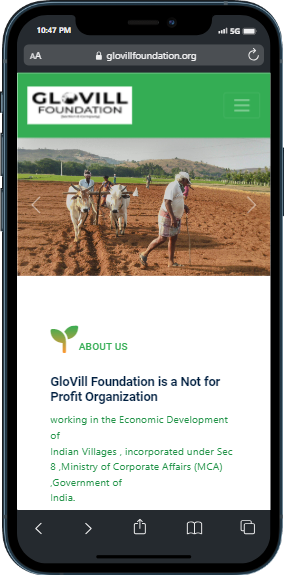

<br/>
<p align="center">
  <a href="https://github.com/Prashanthkumarpk/GlovillFoundationWebsite">
    
  </a>

  <h3 align="center">Glovill Foundation Website Repository</h3>

  <p align="center">
    "Glovill Foundation is a non-profit organization that works to reinvent and rebuild the village ecosystem, one village at a time."
    <br/>
    <br/>
    <a href="https://github.com/Prashanthkumarpk/GlovillFoundationWebsite"><strong>Explore the docs »</strong></a>
    <br/>
    <br/>
    <a href="https://github.com/Prashanthkumarpk/GlovillFoundationWebsite">View Demo</a>
    .
    <a href="https://github.com/Prashanthkumarpk/GlovillFoundationWebsite/issues">Report Bug</a>
    .
    <a href="https://github.com/Prashanthkumarpk/GlovillFoundationWebsite/issues">Request Feature</a>
  </p>
</p>

   

## Table Of Contents

* [About the Project](#about-the-project)
* [Built With](#built-with)
* [Getting Started](#getting-started)
  * [Installation](#installation)
* [Roadmap](#roadmap)
* [Contributing](#contributing)
* [Authors](#authors)
* [Acknowledgements](#acknowledgements)

## About The Project



This project is a website developed for Glovil Foundation, a non-profit organization based in India. The website showcases the foundation's mission to reinvent and rebuild the village ecosystem, one village at a time, while aligning with the Sustainable Development Goals and AtmaNirbhar Bharat.

Key Features:
- The website provides information about Glovil Foundation's four key areas of focus: education, health, livelihood, and environment.
- It highlights various programs and initiatives implemented by the foundation, such as The Glovil School, The Glovil Health Center, The Glovil Livelihood Program, and The Glovil Environment Program.
- Users can learn about the foundation's objectives, the impact of its work, and how they can get involved or support the cause.
- The website features a visually appealing design, incorporating HTML, CSS, JavaScript, and Bootstrap frameworks to ensure a responsive and user-friendly experience across different devices.

By documenting this project on GitHub, we aim to maintain a record of the website's development process, codebase, and version history. This documentation will serve as a valuable resource for future maintenance, collaboration, and improvements to the website. Developers and contributors can refer to this repository to understand the project structure, implement new features, fix issues, and suggest enhancements.

Through this GitHub repository, we encourage community participation, feedback, and collaboration to help Glovil Foundation achieve its goals of empowering rural communities, providing quality education, healthcare, livelihood opportunities, and preserving the environment. Together, we can make a positive impact and contribute to a more sustainable and self-reliant India.

## Built With

Built With Description for Glovil Foundation Website:

The Glovil Foundation website is built using a combination of modern web technologies and frameworks. It leverages the following tools and languages:

1. HTML: The foundation of the website's structure and content, HTML provides the markup language for organizing and presenting information.

2. CSS: Cascading Style Sheets (CSS) is used to define the visual layout, styles, and aesthetics of the website, ensuring a visually appealing and consistent design.

3. JavaScript: JavaScript adds interactivity and enhances the user experience on the website. It enables dynamic features, such as dropdown menus, slideshow galleries, and form validation.

4. Bootstrap: The website incorporates the Bootstrap framework, which provides a responsive grid system, pre-designed components, and CSS styles. This ensures that the website adapts seamlessly to different screen sizes and devices.

Together, these technologies empower the Glovil Foundation website with a user-friendly interface, a visually appealing design, and interactive elements. By leveraging HTML, CSS, JavaScript, and Bootstrap, the website offers a seamless browsing experience while effectively conveying the foundation's mission, programs, and initiatives to its visitors.

* []()

## Getting Started

This is an example of how you may give instructions on setting up your project locally.
To get a local copy up and running follow these simple example steps.

### Installation

1. Clone the repo

```sh
git clone https://github.com/your_username_/Project-Name.git
```

2. Run the index.html file  with live server in vs code


## Roadmap

See the [open issues](https://github.com/Prashanthkumarpk/GlovillFoundationWebsite/issues) for a list of proposed features (and known issues).

## Contributing

Contributions are what make the open source community such an amazing place to be learn, inspire, and create. Any contributions you make are **greatly appreciated**.
* If you have suggestions for adding or removing projects, feel free to [open an issue](https://github.com/Prashanthkumarpk/GlovillFoundationWebsite/issues/new) to discuss it, or directly create a pull request after you edit the *README.md* file with necessary changes.
* Please make sure you check your spelling and grammar.
* Create individual PR for each suggestion.
* Please also read through the [Code Of Conduct](https://github.com/Prashanthkumarpk/GlovillFoundationWebsite/blob/main/CODE_OF_CONDUCT.md) before posting your first idea as well.

### Creating A Pull Request

1. Fork the Project
2. Create your Feature Branch (`git checkout -b feature/AmazingFeature`)
3. Commit your Changes (`git commit -m 'Add some AmazingFeature'`)
4. Push to the Branch (`git push origin feature/AmazingFeature`)
5. Open a Pull Request


## Authors

* **PrasanthKumar Yernagula** - *Comp Sci Student* - [PrasanthKumar Yernagula](https://github.com/Prashanthkumarpk) - **
* **Chandana Yeranagu** - *Comp Sci Student* - [Chandana Yeranagu](https://github.com/chandanay7) - **

## Acknowledgements

* [PrasanthKumar Yernagula](https://github.com/Prashanthkumarpk)
* [Chandana Yeranagu](https://github.com/chandanay7)

